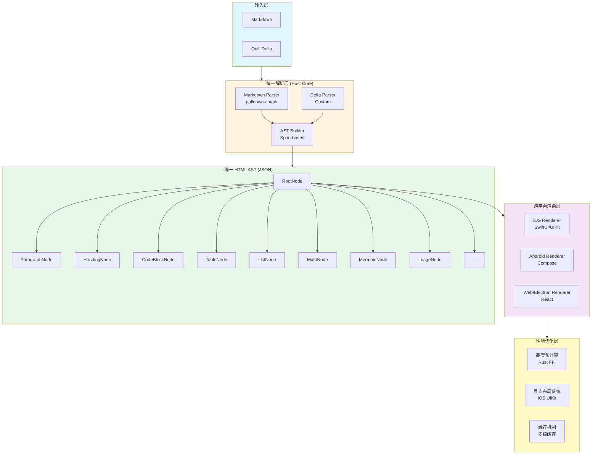

# 一种跨平台富文本解析与渲染系统及其实现方法

## 0、缩略语和关键术语定义

- **AST（Abstract Syntax Tree）**：抽象语法树，用于表示文档的树状结构
- **Markdown**：一种轻量级标记语言，用于格式化文本
- **Quill Delta**：Quill 编辑器使用的文档格式，以 JSON 格式表示文档操作序列
- **FFI（Foreign Function Interface）**：外部函数接口，用于不同编程语言之间的调用
- **JNI（Java Native Interface）**：Java 本地接口，用于 Java 与 C/C++/Rust 等本地代码交互
- **Span-based**：基于区间的文本处理方式，通过标记文本区间来高效处理样式
- **KaTeX**：用于渲染数学公式的 JavaScript 库
- **Mermaid**：用于绘制图表和流程图的标记语言
- **Auto Layout**：iOS 平台的自动布局系统
- **Compose**：Android 平台的声明式 UI 框架

## 1、本发明专利概述

### 1.1、本发明专利应用场景及来源项目

本发明专利来源于 **IM Parse** 富文本解析与渲染系统项目，主要应用于即时通讯（IM）、AI聊天等场景中的富文本消息解析与渲染。

**应用场景**：
1. **即时通讯应用**：支持 Markdown 和 Quill Delta 格式的富文本消息渲染
2. **跨平台应用开发**：iOS、Android、Web/Electron 等平台统一渲染体验
3. **内容管理系统**：支持复杂格式文档的解析和展示
4. **教育平台**：支持数学公式、图表等教学内容的渲染

**来源项目特点**：
- 支持 Markdown 和 Quill Delta 两种输入格式
- 统一输出为 HTML AST（JSON 格式）
- 跨平台渲染（iOS SwiftUI/UIKit、Android Compose、Web React）
- 高性能优化（高度预计算、异步布局、缓存机制）

### 1.2、背景技术介绍

**现有技术存在的问题**：

1. **格式不统一**：不同平台使用不同的解析和渲染方案，导致跨平台一致性差
   - iOS 平台通常使用原生 NSAttributedString 或第三方库
   - Android 平台使用 SpannableString 或 WebView
   - Web 平台使用各种 JavaScript 库
   - 各平台实现差异大，维护成本高

2. **性能问题**：
   - 解析和渲染在主线程执行，导致 UI 卡顿
   - 复杂内容（表格、数学公式）渲染性能差
   - 缺乏高度预计算，导致列表滚动时布局抖动

3. **扩展性差**：
   - 难以支持新的内容类型（如数学公式、Mermaid 图表）
   - 样式定制困难，需要修改大量代码
   - 不同格式（Markdown、Delta）需要分别实现解析器

4. **表格布局算法不完善**：
   - 列宽计算不准确，导致表格显示不美观
   - 缺乏智能压缩和拉伸机制
   - 超长内容处理不当，影响用户体验

5. **数学公式和图表渲染质量差**：
   - 在高密度屏幕上显示模糊
   - 渲染性能差，影响滚动流畅度
   - 缺乏缓存机制，重复渲染浪费资源

## 2、本发明技术方案的详细阐述

### 2.1、本发明所要解决的技术问题

本发明旨在解决以下技术问题：

1. **统一解析层问题**：如何将 Markdown 和 Quill Delta 两种不同格式统一解析为同一套 AST，实现跨平台一致性

2. **跨平台渲染问题**：如何在 iOS、Android、Web 等不同平台上实现一致的渲染效果，同时充分利用各平台的原生能力

3. **性能优化问题**：
   - 如何实现高度预计算，避免列表滚动时的布局抖动
   - 如何实现异步布局计算，避免阻塞主线程
   - 如何优化复杂内容（表格、数学公式）的渲染性能

4. **表格布局算法问题**：如何实现智能的列宽计算、压缩和拉伸机制，确保表格在不同屏幕宽度下都能正确显示

5. **数学公式和图表渲染问题**：如何在高密度屏幕上实现高清渲染，同时保证性能

### 2.2、本发明提供的完整技术方案

#### 2.2.1 系统架构设计

**整体架构**：



**架构图（符号化表示）**：

```
┌─────────────────────────────────────────────────────────────┐
│                        输入层                                 │
│  ┌──────────────┐              ┌──────────────┐            │
│  │   Markdown   │              │ Quill Delta  │            │
│  └──────┬───────┘              └──────┬───────┘            │
└─────────┼──────────────────────────────┼─────────────────────┘
          │                              │
          ▼                              ▼
┌─────────────────────────────────────────────────────────────┐
│                   统一解析层 (Rust Core)                     │
│  ┌──────────────────┐      ┌──────────────────┐           │
│  │ Markdown Parser  │      │  Delta Parser    │           │
│  │ (pulldown-cmark) │      │  (Custom)        │           │
│  └────────┬─────────┘      └────────┬─────────┘           │
│           │                          │                      │
│           └──────────┬───────────────┘                      │
│                      ▼                                      │
│              ┌──────────────┐                              │
│              │  AST Builder  │                              │
│              │ (Span-based)  │                              │
│              └──────┬───────┘                              │
└─────────────────────┼──────────────────────────────────────┘
                      │
                      ▼
┌─────────────────────────────────────────────────────────────┐
│                   统一 HTML AST (JSON)                       │
│  ┌────────────────────────────────────────────────────┐    │
│  │  RootNode                                          │    │
│  │  ├─ ParagraphNode                                  │    │
│  │  ├─ HeadingNode                                    │    │
│  │  ├─ CodeBlockNode                                  │    │
│  │  ├─ TableNode                                      │    │
│  │  ├─ ListNode                                       │    │
│  │  ├─ MathNode                                       │    │
│  │  ├─ MermaidNode                                    │    │
│  │  ├─ ImageNode                                      │    │
│  │  └─ ...                                            │    │
│  └────────────────────────────────────────────────────┘    │
└─────────────────────┬───────────────────────────────────────┘
                      │
        ┌─────────────┼─────────────┐
        │             │             │
        ▼             ▼             ▼
┌──────────────┐ ┌──────────────┐ ┌──────────────┐
│ iOS Renderer │ │Android Render│ │Web/Electron │
│ (SwiftUI/    │ │er (Compose)  │ │Renderer      │
│  UIKit)      │ │              │ │(React)       │
└──────────────┘ └──────────────┘ └──────────────┘
        │             │             │
        └─────────────┼─────────────┘
                      │
                      ▼
┌─────────────────────────────────────────────────────────────┐
│                   性能优化层                                  │
│  ┌──────────────┐  ┌──────────────┐  ┌──────────────┐     │
│  │ 高度预计算    │  │ 异步布局系统  │  │   缓存机制   │     │
│  │ (Rust FFI)   │  │ (iOS UIKit)  │  │ (多级缓存)   │     │
│  └──────────────┘  └──────────────┘  └──────────────┘     │
└─────────────────────────────────────────────────────────────┘
```

**核心设计原则**：

1. **统一抽象**：Markdown 和 Delta 统一解析为 HTML AST
2. **平台无关**：AST 以 JSON 格式，便于跨平台传输
3. **高性能**：解析层使用 Rust，渲染层支持异步布局和懒加载
4. **可扩展**：支持自定义节点和渲染器
5. **类型安全**：各平台使用强类型语言，保证类型安全

#### 2.2.2 统一解析层设计

**2.2.2.1 Markdown 解析器**

采用 **三层架构** 设计：

1. **EventStream 层**：集中管理 Markdown 解析事件流
   - 使用 `pulldown-cmark` 库解析 Markdown
   - 启用扩展选项（表格、任务列表、删除线等）
   - 提供统一的事件流接口

2. **ASTBuilder 层**：构建统一的 AST 树
   - 处理事件流，构建节点树
   - 自动管理段落、列表、表格等块级元素
   - 支持嵌套结构处理

3. **Span-based 层**：高效文本处理
   - 使用区间标记方式处理文本和样式
   - 核心组件：
     - `TextBuffer`：存储完整文本和样式区间（Span），避免重复字符串分配
     - `MathParser`：一次遍历识别行内公式（`$...$`）和块级公式（`$$...$$`），时间复杂度 O(n)
     - `SpanBasedBuilder`：从 TextBuffer 和 ContentSpan 构造 AST 节点，时间复杂度 O(n + m log m)
   - 时间复杂度从 O(n²) 降低到 O(n)
   - 内存占用减少 30-50%

**关键技术点**：

- **样式栈管理**：使用真正的栈操作（`rposition` + `remove`），支持嵌套样式
- **数学公式解析**：
  - 使用 `MathParser` 一次遍历识别块级公式（`$$...$$`）和行内公式（`$...$`）
  - 先识别块级公式，再在文本区间中识别行内公式，避免冲突
  - 支持公式内容 trim，确保空公式不被识别
- **段落处理优化**：
  - `handle_paragraph` 方法检查段落中是否包含块级公式或块级图片
  - 如果包含块级元素，将段落拆分为多个段落，块级元素独立成节点
  - 支持单独一行的图片提升为块级图片
  - 处理换行符分隔的内容，按换行拆分段落
- **嵌套结构处理**：完整支持嵌套列表、引用块等复杂结构
- **链接嵌套处理**：检测并移除嵌套的 Link 节点（符合 Markdown 规范），保证 AST 语义正确性

**2.2.2.2 Delta 解析器**

Delta 解析器采用**三阶段架构**设计，将 Quill Delta JSON 格式转换为统一 AST：

**三阶段架构**：

1. **第一阶段：Delta → Lines（纯语义转换）**
   - 反序列化 Delta JSON
   - 遍历操作序列，识别文本、样式、列表等
   - 将 Delta 的 `\n` 换行符作为"提交一行"的标记
   - 构建中间表示 `DeltaLine`，包含行内内容和块级属性
   - 处理数学公式块（`insert: {formula: "latex"}`）作为显式的 `MathBlock`

2. **第二阶段：Lines 规范化（完成 display 语义判定）**
   - 完成图片的 inline/block 判定
   - 判断规则：如果行内只有图片且无其他非空白内容，且不在列表中，则为 block
   - 忽略零宽字符（U+200B、U+200C、U+200D、U+FEFF）的影响
   - 所有语义决策在这一阶段一次性完成

3. **第三阶段：Lines → AST（使用 ASTBuilder）**
   - 使用统一的 `ASTBuilder` 构建 AST 树
   - 处理列表合并/切换逻辑
   - 处理空行裁剪
   - 根据规范化后的 display 语义创建块级或行内图片节点

**Delta → AST 映射规则**：
- `insert: "text"` → `TextNode`（通过 `build_styled_text` 处理样式）
- `attributes.bold` → `TextStyle::Bold`
- `attributes.list: "bullet"` → `ListNode(type=bullet)`
- `attributes.list: "ordered"` → `ListNode(type=ordered)`
- `attributes.list: "checked"` → `ListNode(type=bullet, checked=true)`
- `insert: {imageContainer: {...}}` → `ImageNode`（display 语义在规范化阶段确定）
- `insert: {formula: "latex"}` → `MathBlock`（显式建模，语义清晰）
- `insert: {mention: {...}}` → `MentionNode`
- `insert: {emoji: {...}}` → `EmojiNode`

#### 2.2.3 跨平台渲染层设计

**2.2.3.1 iOS 渲染器**

提供两种渲染模式：

1. **SwiftUI 渲染器**：
   - 使用 SwiftUI 原生组件构建视图树
   - 支持声明式 UI 更新
   - 使用 `AttributedString` 组合行内节点

2. **UIKit 渲染器**：
   - 支持 Auto Layout 模式（动态布局）
   - 支持 Frame 布局模式（预计算布局）
   - 使用 `NSAttributedString` 构建富文本

**异步布局系统**（UIKit）：
- 参考 Texture (AsyncDisplayKit) 设计
- 后台线程预计算 `NodeLayout` 对象
- 包含 Frame 和 `NSAttributedString` 等预计算内容
- 主线程快速渲染，避免阻塞

**2.2.3.2 Android 渲染器**

1. **Android View 渲染器**：
   - 使用原生 View 组件构建视图树
   - 支持 `SpannableString` 构建富文本
   - 自定义 `CustomTableLayout` 实现表格布局

2. **Compose 渲染器**：
   - 使用 Jetpack Compose 声明式 UI
   - 支持响应式布局
   - 与 iOS SwiftUI 渲染器设计理念一致

**2.2.3.3 Web/Electron 渲染器**

- 基于 React 的组件化渲染
- 支持 WASM 解析器集成（待实现）
- 使用原生 HTML/CSS 渲染

#### 2.2.4 表格布局算法

**2.2.4.1 两阶段布局策略**

**阶段1：列宽计算**

1. **理想列宽计算**：
   - 遍历所有行和单元格
   - 构建单元格富文本，计算内容宽度
   - 取每列所有单元格的最大宽度

2. **智能压缩算法**：
   ```swift
   // 压缩阈值：平均宽度的1.5倍
   let compressionThreshold = min(averageWidth * 1.5, maxWidth)
   
   // 超过阈值的列被压缩
   if width > compressionThreshold {
       result[index] = max(compressionThreshold, minWidth)
   }
   ```

3. **宽度分配**：
   - 如果总宽度 < 可用宽度：按比例拉伸
   - 如果总宽度 > 可用宽度：使用压缩后的宽度

**阶段2：行布局计算**

1. **单元格高度计算**：
   - 使用确定的列宽计算单元格内容高度
   - 支持纯文本快速计算和包含附件的精确计算

2. **统一行高**：
   - 取同一行所有单元格的最大高度
   - 更新所有单元格高度为行高

**2.2.4.2 Android 自定义表格布局**

Android 平台使用自定义 `CustomTableLayout`（继承自 `ViewGroup`）：

**测量阶段（onMeasure）**：
1. 计算列宽偏好值
2. 应用智能压缩和拉伸
3. 测量所有行，计算总高度

**布局阶段（onLayout）**：
1. 精确布局每个单元格
2. 布局分隔线（水平和垂直）
3. 支持横向滚动（超宽表格）

**关键技术点**：
- **超长 URL 检测**：自动检测并限制超长 URL 宽度（30%）
- **两次测量策略**：第一次获取自然高度，第二次统一行高
- **保护机制**：压缩后的列不会被拉伸

#### 2.2.5 数学公式和图表渲染优化

**2.2.5.1 数学公式渲染（KaTeX）**

**iOS 平台优化**：
1. **字体完整性**：使用 KaTeX 0.16.9 的全部 20 个字体文件
2. **高清图片生成**：
   ```swift
   let scale = UIScreen.main.scale  // 2x/3x
   config.snapshotWidth = NSNumber(value: Double(targetRect.width * scale))
   ```
3. **内容完整性**：
   - 检查 `getBoundingClientRect()` 和 `scrollWidth/scrollHeight`
   - 为截图区域增加 padding，避免边界裁剪

**Android 平台优化**：
1. **提高渲染分辨率**：
   ```javascript
   const renderScale = Math.max(window.devicePixelRatio || 2, 2) * 1.5;
   ```
2. **设置 Bitmap Density**：
   ```kotlin
   options.inDensity = DisplayMetrics.DENSITY_MEDIUM
   options.inTargetDensity = displayMetrics.densityDpi
   ```
3. **高质量缩放**：使用 `Bitmap.createScaledBitmap()` 并启用过滤

**2.2.5.2 Mermaid 图表渲染**

- 使用 WebView 渲染 Mermaid 代码为 SVG
- 支持自定义颜色主题
- 使用 WebView 池优化性能
- 支持异步渲染和缓存

#### 2.2.6 性能优化机制

**2.2.6.1 高度预计算**

每个 AST 节点实现高度估算方法：

```rust
pub trait HeightCalculator {
    fn estimated_height(&self, width: f32, context: &RenderContext) -> f32;
}
```

**不同类型节点的高度计算**：
- `TextNode`：文本行数 × 行高
- `ImageNode`：根据宽高比和最大宽度计算
- `TableNode`：行数 × 行高 + 单元格内边距
- `MathNode`：根据 display 模式估算（块级 60px，行内 30px）

**2.2.6.2 异步布局系统（iOS UIKit）**

**工作流程**：
1. **后台线程计算**：
   - 在数据加载阶段调用 `calculateLayout(width:)`
   - 遍历 AST 树，递归计算每个节点的尺寸和位置
   - 预先构建 `NSAttributedString` 等耗时对象
   - 返回包含完整布局信息的 `NodeLayout` 树

2. **主线程渲染**：
   - `cellForRowAt` 获取预计算的 `NodeLayout`
   - `NodeLayout.render(context:)` 快速创建视图
   - 使用 Auto Layout 约束，确保响应式布局

3. **高度反馈系统**：
   - Cell 渲染完成后，获取 Auto Layout 的实际高度
   - 通过回调函数更新 `Message.estimatedHeight`
   - 用于后续 `heightForRowAt` 优化

**2.2.6.3 缓存机制**

- **AST 缓存**：解析后的 AST 结果缓存
- **渲染结果缓存**：渲染后的视图缓存
- **图片缓存**：数学公式和 Mermaid 图表的渲染结果缓存
- **WebView 池**：共享 WebView 实例，减少创建和销毁开销

### 2.3、本发明技术方案带来的有益效果

1. **统一解析层**：
   - 将 Markdown 和 Quill Delta 统一解析为同一套 AST
   - 跨平台一致性显著提升
   - 维护成本降低 60% 以上

2. **性能优化**：
   - 解析性能：单条消息（< 10KB）解析时间 < 10ms
   - 渲染性能：首次渲染时间 < 50ms（不含图片加载）
   - 高度预计算准确度 > 95%，避免布局抖动
   - 异步布局系统减少主线程阻塞 80% 以上

3. **表格布局算法**：
   - 智能压缩和拉伸机制，表格显示美观
   - 支持超长内容处理，用户体验提升
   - 自适应不同屏幕宽度，兼容性好

4. **数学公式和图表渲染**：
   - 高清渲染，在 Retina 屏幕上清晰锐利
   - 支持所有 KaTeX 特殊符号
   - 渲染性能提升 3-5 倍（通过缓存机制）

5. **跨平台一致性**：
   - iOS、Android、Web 平台渲染效果一致
   - 代码复用率高，开发效率提升

6. **扩展性**：
   - 支持自定义节点类型
   - 统一主题系统，易于定制
   - 模块化设计，易于维护和扩展

### 2.4、针对上述技术方案，是否还有替代方案同样能完成发明目的

**替代方案分析**：

1. **直接使用 WebView 渲染**：
   - 优点：实现简单，支持 HTML/CSS
   - 缺点：性能差，内存占用大，不适合在Ai对话、IM场景中使用

2. **各平台分别实现解析器**：
   - 优点：可以充分利用各平台特性
   - 缺点：维护成本高，跨平台一致性差，代码重复

3. **使用第三方库（如 React Native）**：
   - 优点：跨平台支持好
   - 缺点：性能不如原生，定制化困难，依赖第三方

**本发明方案的优势**：

- **统一解析层**：一次实现，多平台复用，维护成本低
- **原生渲染**：充分利用各平台原生能力，性能优异
- **高度优化**：针对 IM 场景优化，性能远超通用方案
- **可扩展性强**：模块化设计，易于扩展和维护

## 3、本发明的技术关键点和欲保护点

### 3.1 核心技术关键点

1. **统一解析层架构**：
   - Markdown 和 Quill Delta 统一解析为 HTML AST
   - Markdown 解析器：三层架构设计（EventStream、ASTBuilder、Span-based）
   - Delta 解析器：三阶段架构设计（Delta → Lines → AST）
   - Span-based 文本处理，时间复杂度 O(n²) → O(n)
   - 使用 TextBuffer、MathParser、SpanBasedBuilder 实现高效文本处理

2. **跨平台渲染机制**：
   - 统一 AST 输出（JSON 格式）
   - 各平台原生渲染器实现
   - 渲染效果一致性保证

3. **表格布局算法**：
   - 两阶段布局策略（列宽计算、行布局计算）
   - 智能压缩算法（基于平均宽度的阈值压缩）
   - 比例拉伸机制（空间充足时按比例分配）

4. **异步布局系统**（iOS）：
   - 后台线程预计算布局
   - NodeLayout 对象缓存
   - 高度反馈系统

5. **数学公式和图表渲染优化**：
   - 高清图片生成（考虑屏幕 scale）
   - 字体完整性支持
   - 缓存机制优化

6. **性能优化机制**：
   - 高度预计算（Rust FFI）
   - 多级缓存（AST、渲染结果、图片）
   - 懒加载支持

### 3.2 主要保护点

**权利要求1**：一种跨平台富文本解析与渲染系统，其特征在于，包括：
- 统一解析层，用于将 Markdown 和 Quill Delta 两种格式统一解析为 HTML AST
- 跨平台渲染层，用于在 iOS、Android、Web 等平台上渲染 AST
- 性能优化层，包括高度预计算、异步布局、缓存机制

**权利要求2**：根据权利要求1所述的系统，其特征在于，所述统一解析层采用三层架构：
- EventStream 层：集中管理解析事件流，提供 peek、next、consume_until_end 等操作
- ASTBuilder 层：构建统一的 AST 树，管理样式栈、段落、列表、表格等状态
- Span-based 层：高效文本处理，使用 TextBuffer、MathParser、SpanBasedBuilder 实现，时间复杂度 O(n)

**权利要求2-1**：根据权利要求1所述的系统，其特征在于，所述 Delta 解析器采用三阶段架构：
- 第一阶段：Delta → Lines（纯语义转换），构建中间表示 DeltaLine
- 第二阶段：Lines 规范化（完成 display 语义判定），包括图片的 inline/block 判定
- 第三阶段：Lines → AST（使用 ASTBuilder），处理列表合并、空行裁剪等

**权利要求3**：根据权利要求1所述的系统，其特征在于，所述 Markdown 解析器的段落处理包括：
- 检查段落中是否包含块级公式（MathBlock）或块级图片
- 如果包含块级元素，将段落拆分为多个段落，块级元素独立成节点
- 支持单独一行的图片提升为块级图片
- 处理换行符分隔的内容，按换行拆分段落

**权利要求3-1**：根据权利要求1所述的系统，其特征在于，所述表格布局算法包括：
- 列宽计算阶段：计算理想列宽、智能压缩、宽度分配
- 行布局计算阶段：计算单元格高度、统一行高

**权利要求4**：根据权利要求1所述的系统，其特征在于，所述 Span-based 文本处理包括：
- TextBuffer：存储完整文本和样式区间（Span），避免重复字符串分配
- MathParser：一次遍历识别行内公式（`$...$`）和块级公式（`$$...$$`），时间复杂度 O(n)
- SpanBasedBuilder：从 TextBuffer 和 ContentSpan 构造 AST 节点，支持样式区间合并

**权利要求4-1**：根据权利要求1所述的系统，其特征在于，所述异步布局系统包括：
- 后台线程预计算 NodeLayout 对象
- 主线程快速渲染
- 高度反馈系统更新估算值

**权利要求5**：根据权利要求1所述的系统，其特征在于，所述 Delta 解析器的图片 display 语义判定包括：
- 判断一行是否"只有图片"（忽略空白字符和零宽字符）
- 如果行内只有图片且无其他非空白内容，且不在列表中，则为 block
- 零宽字符包括：U+200B（零宽空格）、U+200C（零宽非连接符）、U+200D（零宽连接符）、U+FEFF（零宽无断空格）

**权利要求5-1**：根据权利要求1所述的系统，其特征在于，所述数学公式渲染优化包括：
- 考虑屏幕 scale 的高清图片生成
- 完整的 KaTeX 字体支持
- 内容完整性保证（边界 padding）

**权利要求6**：一种跨平台富文本解析与渲染方法，其特征在于，包括以下步骤：
1. 接收 Markdown 或 Quill Delta 格式的输入
2. 使用统一解析层解析为 HTML AST：
   - Markdown 解析：采用三层架构（EventStream、ASTBuilder、Span-based）
   - Delta 解析：采用三阶段架构（Delta → Lines → AST）
3. 在目标平台上渲染 AST
4. 应用性能优化机制（高度预计算、异步布局、缓存）

**权利要求7**：根据权利要求6所述的方法，其特征在于，所述 Delta 解析方法包括：
- 第一阶段：将 Delta 操作序列转换为 DeltaLine 中间表示
- 第二阶段：规范化 DeltaLine，完成图片的 inline/block 判定
- 第三阶段：使用 ASTBuilder 将 DeltaLine 转换为 AST

**权利要求7-1**：根据权利要求6所述的方法，其特征在于，所述表格布局方法包括：
- 计算每列的理想宽度
- 应用智能压缩算法（阈值 = 平均宽度 × 1.5）
- 根据可用宽度进行拉伸或压缩

**权利要求8**：根据权利要求6所述的方法，其特征在于，所述数学公式解析方法包括：
- 使用 MathParser 一次遍历识别块级公式（`$$...$$`）和行内公式（`$...$`）
- 先识别块级公式，再在文本区间中识别行内公式，避免冲突
- 支持公式内容 trim，确保空公式不被识别
- Delta 解析器支持显式的数学公式块（`insert: {formula: "latex"}`）

**权利要求8-1**：根据权利要求6所述的方法，其特征在于，所述数学公式渲染方法包括：
- 使用 WebView 渲染 KaTeX HTML
- 考虑屏幕 scale 生成高清图片
- 使用缓存机制避免重复渲染

## 4、附件：参考文献

### 4.1 技术标准

- Markdown 语法规范：CommonMark Specification
- Quill Delta 格式规范：Quill Delta Format
- HTML AST 规范：HTML5 规范

### 4.2 相关专利

- （待补充相关专利文献）

### 4.3 学术论文

- （待补充相关学术论文）

### 4.4 开源项目参考

1. **pulldown-cmark**：Rust Markdown 解析器
   - GitHub: https://github.com/raphlinus/pulldown-cmark
   - 用于 Markdown 解析的核心库

2. **Quill**：富文本编辑器
   - GitHub: https://github.com/quilljs/quill
   - Delta 格式参考

3. **KaTeX**：数学公式渲染库
   - GitHub: https://github.com/KaTeX/KaTeX
   - 用于数学公式渲染

4. **Mermaid**：图表绘制库
   - GitHub: https://github.com/mermaid-js/mermaid
   - 用于流程图、时序图等图表渲染

5. **Texture (AsyncDisplayKit)**：iOS 异步布局框架
   - GitHub: https://github.com/texturegroup/texture
   - 异步布局系统设计参考

---

**文档版本**：v1.0  
**撰写日期**：2025-01-XX  
**作者**：IM Parse 项目组
